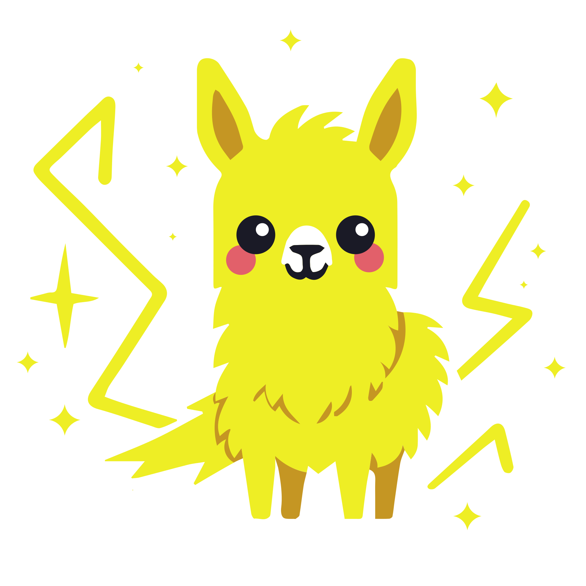
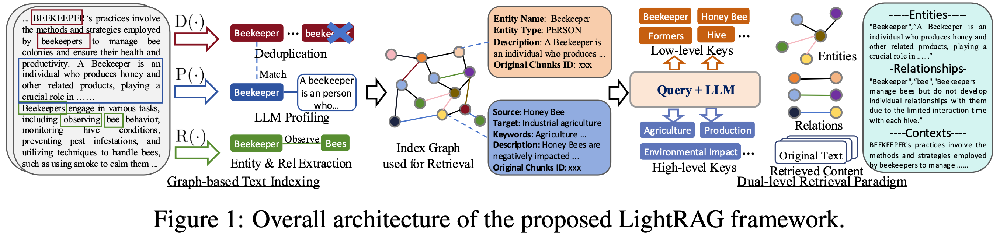

<div align="center">

<div style="margin: 20px 0;">
  
</div>

# 🚀 LightRAG: 간단하고 빠른 검색 증강 생성

<div align="center">
    <a href="https://trendshift.io/repositories/13043" target="_blank"></a>
</div>
<p>
</p>
<div align="center">
  <div style="width: 100%; height: 2px; margin: 20px 0; background: linear-gradient(90deg, transparent, #00d9ff, transparent);"></div>
</div>

<div align="center">
  <div style="background: linear-gradient(135deg, #667eea 0%, #764ba2 100%); border-radius: 15px; padding: 25px; text-align: center;">
    <p>
      <a href='https://github.com/HKUDS/LightRAG'></a>
      <a href='https://arxiv.org/abs/2410.05779'></a>
      <a href="https://github.com/HKUDS/LightRAG/stargazers"></a>
    </p>
    <p>
      
      <a href="https://pypi.org/project/lightrag-hku/"></a>
    </p>
    <p>
      <a href="https://discord.gg/yF2MmDJyGJ"></a>
      <a href="https://github.com/HKUDS/LightRAG/issues/285"></a>
    </p>
    <p>
      <a href="README.md"></a>
      <a href="README-ko.md"></a>
    </p>
    <p>
      <a href="https://pepy.tech/projects/lightrag-hku"></a>
    </p>
  </div>
</div>

</div>

<div align="center" style="margin: 30px 0;">
  
</div>

<div align="center" style="margin: 30px 0;">
    
</div>

---

<div align="center">
  <table>
    <tr>
      <td style="vertical-align: middle;">
        
      </td>
      <td style="vertical-align: middle; padding-left: 12px;">
        <a href="https://litewrite.ai">
          
        </a>
      </td>
    </tr>
  </table>
</div>

---

## 🎉 뉴스
- [2026.05]🎯[새 기능]: **RagAnything를 LightRAG에 통합**🎉. **MinerU / Docling** 서비스를 통한 멀티모달 콘텐츠 파싱 및 추출.
- [2026.05]🎯[새 기능]: 선택 가능한 네 가지 텍스트 청킹(chunking) 전략 도입: `Fix`, `Recursive`, `Vector`, `Paragraph`.
- [2026.05]🎯[새 기능]: **역할별 LLM 설정** 지원. EXTRACT, QUERY, KEYWORDS, VLM 4가지 역할에 독립적인 LLM 설정.
- [2026.03]🎯[새 기능]: **OpenSearch**를 통합 스토리지 백엔드로 통합, LightRAG의 4가지 스토리지 모두 포괄적 지원.
- [2026.03]🎯[새 기능]: 설정 마법사 도입. Docker를 통한 임베딩, 리랭킹, 스토리지 백엔드의 로컬 배포 지원.
- [2025.11]🎯[새 기능]: **평가를 위한 RAGAS**와 **추적을 위한 Langfuse** 통합. 문맥 정밀도 메트릭을 지원하기 위해 쿼리 결과와 함께 검색된 컨텍스트를 반환하도록 API 업데이트.
- [2025.10]🎯[확장성 향상]: **대규모 데이터셋을 효율적으로** 지원하기 위해 처리 병목 제거.
- [2025.09]🎯[새 기능] Qwen3-30B-A3B와 같은 **오픈소스 LLM**에 대한 지식 그래프 추출 정확도 향상.
- [2025.08]🎯[새 기능] **리랭커(Reranker)** 지원, 혼합 쿼리 성능 대폭 향상 (기본 쿼리 모드로 설정).
- [2025.08]🎯[새 기능] 최적의 쿼리 성능을 위한 자동 KG 재생성을 포함한 **문서 삭제** 추가.
- [2025.06]🎯[새 릴리스] 팀이 [RAG-Anything](https://github.com/HKUDS/RAG-Anything) 출시 — 텍스트, 이미지, 표, 수식을 원활하게 처리하는 **올인원 멀티모달 RAG** 시스템.
- [2025.06]🎯[새 기능] LightRAG가 [RAG-Anything](https://github.com/HKUDS/RAG-Anything) 통합을 통해 포괄적인 멀티모달 데이터 처리를 지원.
- [2025.03]🎯[새 기능] LightRAG가 인용 기능을 지원, 적절한 소스 귀속 및 향상된 문서 추적성 제공.
- [2025.02]🎯[새 기능] 이제 MongoDB를 통합 데이터 관리를 위한 올인원 스토리지 솔루션으로 사용 가능.
- [2025.02]🎯[새 릴리스] 팀이 [VideoRAG](https://github.com/HKUDS/VideoRAG) 출시 — 매우 긴 컨텍스트 비디오 이해를 위한 RAG 시스템.
- [2025.01]🎯[새 릴리스] 팀이 소형 모델로 RAG를 더 간단하게 만드는 [MiniRAG](https://github.com/HKUDS/MiniRAG) 출시.
- [2025.01]🎯이제 PostgreSQL을 데이터 관리를 위한 올인원 스토리지 솔루션으로 사용 가능.
- [2024.11]🎯[새 자원] LightRAG에 대한 포괄적인 가이드가 [LearnOpenCV](https://learnopencv.com/lightrag)에서 이용 가능.
- [2024.11]🎯[새 기능] LightRAG WebUI 도입 — 직관적인 웹 기반 대시보드를 통해 LightRAG 지식을 삽입, 쿼리, 시각화할 수 있는 인터페이스.
- [2024.11]🎯[새 기능] 이제 [그래프 데이터베이스 지원을 위해 Neo4J를 스토리지로 사용](https://github.com/HKUDS/LightRAG?tab=readme-ov-file#using-neo4j-for-storage) 가능.
- [2024.10]🎯[새 기능] [LightRAG 소개 영상](https://youtu.be/oageL-1I0GE) 링크 추가.
- [2024.10]🎯[새 채널] [Discord 채널](https://discord.gg/yF2MmDJyGJ) 생성!💬 커뮤니티에 참여하여 공유, 토론, 협업하세요! 🎉🎉

<details>
  <summary style="font-size: 1.4em; font-weight: bold; cursor: pointer; display: list-item;">
    알고리즘 순서도
  </summary>


*그림 1: LightRAG 인덱싱 순서도 - 이미지 출처 : [Source](https://learnopencv.com/lightrag/)*

*그림 2: LightRAG 검색 및 쿼리 순서도 - 이미지 출처 : [Source](https://learnopencv.com/lightrag/)*

</details>

## 설치

**💡 패키지 관리를 위한 uv 사용**: 이 프로젝트는 빠르고 신뢰할 수 있는 Python 패키지 관리를 위해 [uv](https://docs.astral.sh/uv/)를 사용합니다. 먼저 uv를 설치하세요: `curl -LsSf https://astral.sh/uv/install.sh | sh` (Unix/macOS) 또는 `powershell -c "irm https://astral.sh/uv/install.ps1 | iex"` (Windows)

> **참고**: pip도 사용할 수 있지만, 더 나은 성능과 더 신뢰할 수 있는 의존성 관리를 위해 uv를 권장합니다.
>
> **📦 오프라인 배포**: 오프라인 또는 에어갭(air-gapped) 환경의 경우, 모든 의존성과 캐시 파일을 사전 설치하는 방법에 대한 [오프라인 배포 가이드](./docs/OfflineDeployment-ko.md)를 참조하세요.

### LightRAG 서버 설치

LightRAG 서버는 Web UI와 API 지원을 제공하도록 설계되었습니다. Web UI는 문서 인덱싱, 지식 그래프 탐색, 간단한 RAG 쿼리 인터페이스를 제공합니다. LightRAG 서버는 또한 Ollama 호환 인터페이스를 제공하여 LightRAG를 Ollama 채팅 모델로 에뮬레이트합니다. 이를 통해 Open WebUI와 같은 AI 채팅봇이 LightRAG에 쉽게 접근할 수 있습니다.

* PyPI에서 설치

```bash
### uv를 사용하여 LightRAG 서버를 도구로 설치 (권장)
uv tool install "lightrag-hku[api]"

### 또는 pip 사용
# python -m venv .venv
# source .venv/bin/activate  # Windows: .venv\Scripts\activate
# pip install "lightrag-hku[api]"

### 프런트엔드 아티팩트 빌드
cd lightrag_webui
bun install --frozen-lockfile
bun run build
cd ..

# 환경 파일 설정
# GitHub 저장소 루트에서 env.example 파일을 다운로드하거나
# 로컬 소스 체크아웃에서 복사하세요.
cp env.example .env  # .env를 LLM 및 임베딩 설정으로 업데이트
# 서버 시작
lightrag-server
```

* 소스에서 설치

```bash
git clone https://github.com/HKUDS/LightRAG.git
cd LightRAG

# 개발 환경 부트스트랩 (권장)
make dev
source .venv/bin/activate  # 가상 환경 활성화 (Linux/macOS)
# 또는 Windows에서: .venv\Scripts\activate

# make dev는 테스트 도구 체인과 전체 오프라인 스택을 설치한 후 프런트엔드를 빌드합니다.
# 서버를 시작하기 전에 make env-base를 실행하거나 env.example을 .env로 복사하세요.

# uv를 사용한 동등한 수동 단계
# 참고: uv sync는 자동으로 .venv/에 가상 환경을 생성합니다
uv sync --extra test --extra offline
source .venv/bin/activate  # 가상 환경 활성화 (Linux/macOS)
# 또는 Windows에서: .venv\Scripts\activate

### 또는 가상 환경과 함께 pip 사용
# python -m venv .venv
# source .venv/bin/activate  # Windows: .venv\Scripts\activate
# pip install -e ".[test,offline]"

# 프런트엔드 아티팩트 빌드
cd lightrag_webui
bun install --frozen-lockfile
bun run build
cd ..

# 환경 파일 설정
make env-base  # 또는: cp env.example .env 후 수동으로 업데이트
# API-WebUI 서버 시작
lightrag-server
```

* Docker Compose로 LightRAG 서버 시작

```bash
git clone https://github.com/HKUDS/LightRAG.git
cd LightRAG
cp env.example .env  # .env를 LLM 및 임베딩 설정으로 업데이트
# .env에서 LLM 및 임베딩 설정 수정
docker compose up
```

> LightRAG Docker 이미지의 이전 버전은 여기서 찾을 수 있습니다: [LightRAG Docker Images](https://github.com/HKUDS/LightRAG/pkgs/container/lightrag)
>
> GitHub Actions에 의해 GitHub Container Registry에 배포된 공식 GHCR 이미지는 GitHub OIDC를 사용하는 Sigstore Cosign으로 서명됩니다. 검증 명령어는 [docs/DockerDeployment-ko.md](./docs/DockerDeployment-ko.md)를 참조하세요.

### 설정 도구로 .env 파일 생성

`env.example`을 직접 편집하는 대신, 대화형 설정 마법사를 사용하여 설정된 `.env`와 필요한 경우 `docker-compose.final.yml`을 생성할 수 있습니다:

```bash
make env-base           # 필수 첫 번째 단계: LLM, 임베딩, 리랭커
make env-storage        # 선택 사항: 스토리지 백엔드 및 데이터베이스 서비스
make env-server         # 선택 사항: 서버 포트, 인증, SSL
make env-base-rewrite   # 선택 사항: 마법사 관리 compose 서비스 강제 재생성
make env-storage-rewrite # 선택 사항: 마법사 관리 compose 서비스 강제 재생성
make env-security-check # 선택 사항: 보안 위험에 대해 현재 .env 감사
```

모든 타겟에 대한 전체 설명은 [docs/InteractiveSetup-ko.md](./docs/InteractiveSetup-ko.md)를 참조하세요.
설정 마법사는 설정만 업데이트합니다. 배포 전에 보안 위험에 대해 현재 `.env`를 감사하려면 `make env-security-check`를 별도로 실행하세요.

### LightRAG 코어 설치

* 소스에서 설치 (권장)

```bash
cd LightRAG
# 참고: uv sync는 자동으로 .venv/에 가상 환경을 생성합니다
uv sync
source .venv/bin/activate  # 가상 환경 활성화 (Linux/macOS)
# 또는 Windows에서: .venv\Scripts\activate

# 또는: pip install -e .
```

* PyPI에서 설치

```bash
uv pip install lightrag-hku
# 또는: pip install lightrag-hku
```

## 빠른 시작

### LightRAG를 위한 LLM 및 기술 스택 요구 사항

LightRAG의 대형 언어 모델(LLM) 능력에 대한 요구는 전통적인 RAG보다 훨씬 높습니다. 문서에서 엔티티-관계 추출 작업을 수행하기 위해 LLM이 필요하기 때문입니다. 쿼리 성능 향상을 위해 적절한 임베딩 및 리랭커 모델 설정도 중요합니다.

- **LLM 선택**:
  - 최소 320억 파라미터를 가진 LLM 사용을 권장합니다.
  - 컨텍스트 길이는 최소 32KB여야 하며, 64KB를 권장합니다.
  - 문서 인덱싱 단계에서는 추론 모델을 선택하지 않는 것을 권장합니다.
  - 쿼리 단계에서는 더 나은 쿼리 결과를 위해 인덱싱 단계보다 더 강력한 능력의 모델을 선택하는 것을 권장합니다.
- **임베딩(Embedding) 모델**:
  - 고성능 임베딩 모델은 RAG에 필수적입니다.
  - `BAAI/bge-m3` 및 `text-embedding-3-large`와 같은 주류 다국어 임베딩 모델 사용을 권장합니다.
  - **중요 참고 사항**: 임베딩 모델은 문서 인덱싱 전에 결정되어야 하며, 문서 쿼리 단계에서도 동일한 모델을 사용해야 합니다.
- **리랭커(Reranker) 모델 설정**:
  - 리랭커 모델 설정으로 LightRAG의 검색 성능을 크게 향상시킬 수 있습니다.
  - 리랭커 모델이 활성화된 경우, 기본 쿼리 모드로 "mix 모드"를 설정하는 것을 권장합니다.
  - `BAAI/bge-reranker-v2-m3` 또는 Jina와 같은 서비스가 제공하는 모델과 같은 주류 리랭커 모델 사용을 권장합니다.

### LightRAG 서버 빠른 시작

LightRAG 서버는 Web UI와 API 지원을 제공하도록 설계되었습니다. LightRAG 서버는 포괄적인 지식 그래프 시각화 기능을 제공합니다. 다양한 중력 레이아웃, 노드 쿼리, 하위 그래프 필터링 등을 지원합니다. LightRAG 서버에 대한 자세한 정보는 [LightRAG Server](./docs/LightRAG-API-Server-ko.md)를 참조하세요.


### LightRAG 코어 빠른 시작

LightRAG 코어를 시작하려면 `examples` 폴더에 있는 샘플 코드를 참조하세요. 또한 로컬 설정 과정을 안내하는 [비디오 데모](https://www.youtube.com/watch?v=g21royNJ4fw)도 제공됩니다. OpenAI API 키가 있다면 즉시 데모를 실행할 수 있습니다:

```bash
### 프로젝트 폴더에서 데모 코드를 실행해야 합니다
cd LightRAG
### OpenAI API 키 제공
export OPENAI_API_KEY="sk-...your_opeai_key..."
### Charles Dickens의 "A Christmas Carol" 데모 문서 다운로드
curl https://raw.githubusercontent.com/gusye1234/nano-graphrag/main/tests/mock_data.txt > ./book.txt
### 데모 코드 실행
python examples/lightrag_openai_demo.py
```

스트리밍 응답 구현 예시는 `examples/lightrag_openai_compatible_demo.py`를 참조하세요. 실행 전에 샘플 코드의 LLM 및 임베딩 설정을 적절히 수정하세요.

**참고 1**: 데모 프로그램 실행 시, 다른 테스트 스크립트가 다른 임베딩 모델을 사용할 수 있음에 유의하세요. 다른 임베딩 모델로 전환하려면 데이터 디렉토리(`./dickens`)를 지워야 합니다.

**참고 2**: `lightrag_openai_demo.py`와 `lightrag_openai_compatible_demo.py`만 공식적으로 지원되는 샘플 코드입니다.

## LightRAG 코어로 프로그래밍

초기화 파라미터, `QueryParam`, LLM/임베딩 프로바이더 예시(OpenAI, Ollama, Azure, Gemini, HuggingFace, LlamaIndex), 리랭커 주입, 삽입 작업, 엔티티/관계 관리, 삭제/병합을 포함한 전체 코어 API 레퍼런스는 **[docs/ProgramingWithCore-ko.md](./docs/ProgramingWithCore-ko.md)**를 참조하세요.

> ⚠️ **LightRAG를 프로젝트에 통합하려면 LightRAG 서버에서 제공하는 REST API를 사용하는 것을 권장합니다**. LightRAG 코어는 일반적으로 임베디드 애플리케이션 또는 연구 및 평가를 수행하려는 연구자를 위한 것입니다.

### 고급 기능

LightRAG는 토큰 사용량 추적, 지식 그래프 데이터 내보내기, LLM 캐시 관리, Langfuse 관찰성(observability) 통합, RAGAS 기반 평가를 포함한 추가 기능을 제공합니다. **[docs/AdvancedFeatures-ko.md](./docs/AdvancedFeatures-ko.md)**를 참조하세요.

### 멀티모달 문서 처리

LightRAG 서버는 PDF, Office 문서, 이미지, 표, 수식을 위한 멀티모달 문서 파이프라인을 포함합니다. 파싱은 외부 MinerU 또는 Docling 서비스를 통해 처리되며, 멀티모달 인덱싱은 LightRAG 파이프라인에서 실행됩니다. 설정 세부 사항은 **[docs/AdvancedFeatures-ko.md](./docs/AdvancedFeatures-ko.md)**를 참조하세요.

## 논문 결과 재현

LightRAG는 농업, 컴퓨터 과학, 법률, 혼합 도메인에서 NaiveRAG, RQ-RAG, HyDE, GraphRAG를 지속적으로 능가합니다. 전체 평가 방법론, 프롬프트, 재현 단계는 **[docs/Reproduce-ko.md](./docs/Reproduce-ko.md)**를 참조하세요.

**전체 성능 표**

||**농업(Agriculture)**||**컴퓨터 과학(CS)**||**법률(Legal)**||**혼합(Mix)**||
|----------------------|---------------|------------|------|------------|---------|------------|-------|------------|
||NaiveRAG|**LightRAG**|NaiveRAG|**LightRAG**|NaiveRAG|**LightRAG**|NaiveRAG|**LightRAG**|
|**포괄성(Comprehensiveness)**|32.4%|**67.6%**|38.4%|**61.6%**|16.4%|**83.6%**|38.8%|**61.2%**|
|**다양성(Diversity)**|23.6%|**76.4%**|38.0%|**62.0%**|13.6%|**86.4%**|32.4%|**67.6%**|
|**역량 강화(Empowerment)**|32.4%|**67.6%**|38.8%|**61.2%**|16.4%|**83.6%**|42.8%|**57.2%**|
|**전체(Overall)**|32.4%|**67.6%**|38.8%|**61.2%**|15.2%|**84.8%**|40.0%|**60.0%**|
||RQ-RAG|**LightRAG**|RQ-RAG|**LightRAG**|RQ-RAG|**LightRAG**|RQ-RAG|**LightRAG**|
|**포괄성**|31.6%|**68.4%**|38.8%|**61.2%**|15.2%|**84.8%**|39.2%|**60.8%**|
|**다양성**|29.2%|**70.8%**|39.2%|**60.8%**|11.6%|**88.4%**|30.8%|**69.2%**|
|**역량 강화**|31.6%|**68.4%**|36.4%|**63.6%**|15.2%|**84.8%**|42.4%|**57.6%**|
|**전체**|32.4%|**67.6%**|38.0%|**62.0%**|14.4%|**85.6%**|40.0%|**60.0%**|
||HyDE|**LightRAG**|HyDE|**LightRAG**|HyDE|**LightRAG**|HyDE|**LightRAG**|
|**포괄성**|26.0%|**74.0%**|41.6%|**58.4%**|26.8%|**73.2%**|40.4%|**59.6%**|
|**다양성**|24.0%|**76.0%**|38.8%|**61.2%**|20.0%|**80.0%**|32.4%|**67.6%**|
|**역량 강화**|25.2%|**74.8%**|40.8%|**59.2%**|26.0%|**74.0%**|46.0%|**54.0%**|
|**전체**|24.8%|**75.2%**|41.6%|**58.4%**|26.4%|**73.6%**|42.4%|**57.6%**|
||GraphRAG|**LightRAG**|GraphRAG|**LightRAG**|GraphRAG|**LightRAG**|GraphRAG|**LightRAG**|
|**포괄성**|45.6%|**54.4%**|48.4%|**51.6%**|48.4%|**51.6%**|**50.4%**|49.6%|
|**다양성**|22.8%|**77.2%**|40.8%|**59.2%**|26.4%|**73.6%**|36.0%|**64.0%**|
|**역량 강화**|41.2%|**58.8%**|45.2%|**54.8%**|43.6%|**56.4%**|**50.8%**|49.2%|
|**전체**|45.2%|**54.8%**|48.0%|**52.0%**|47.2%|**52.8%**|**50.4%**|49.6%|


## 🔗 관련 프로젝트

*생태계 및 확장*

<div align="center">
  <table>
    <tr>
      <td align="center">
        <a href="https://github.com/HKUDS/RAG-Anything">
          <div style="width: 100px; height: 100px; background: linear-gradient(135deg, rgba(0, 217, 255, 0.1) 0%, rgba(0, 217, 255, 0.05) 100%); border-radius: 15px; border: 1px solid rgba(0, 217, 255, 0.2); display: flex; align-items: center; justify-content: center; margin-bottom: 10px;">
            <span style="font-size: 32px;">📸</span>
          </div>
          <b>RAG-Anything</b><br>
          <sub>멀티모달 RAG</sub>
        </a>
      </td>
      <td align="center">
        <a href="https://github.com/HKUDS/VideoRAG">
          <div style="width: 100px; height: 100px; background: linear-gradient(135deg, rgba(0, 217, 255, 0.1) 0%, rgba(0, 217, 255, 0.05) 100%); border-radius: 15px; border: 1px solid rgba(0, 217, 255, 0.2); display: flex; align-items: center; justify-content: center; margin-bottom: 10px;">
            <span style="font-size: 32px;">🎥</span>
          </div>
          <b>VideoRAG</b><br>
          <sub>초장문 컨텍스트 비디오 RAG</sub>
        </a>
      </td>
      <td align="center">
        <a href="https://github.com/HKUDS/MiniRAG">
          <div style="width: 100px; height: 100px; background: linear-gradient(135deg, rgba(0, 217, 255, 0.1) 0%, rgba(0, 217, 255, 0.05) 100%); border-radius: 15px; border: 1px solid rgba(0, 217, 255, 0.2); display: flex; align-items: center; justify-content: center; margin-bottom: 10px;">
            <span style="font-size: 32px;">✨</span>
          </div>
          <b>MiniRAG</b><br>
          <sub>매우 간단한 RAG</sub>
        </a>
      </td>
    </tr>
  </table>
</div>

---

## ⭐ 스타 히스토리

[](https://star-history.com/#HKUDS/LightRAG&Date)

## 🤝 기여

<div align="center">
  버그 수정, 새 기능, 문서 개선 등 모든 종류의 기여를 환영합니다.<br>
  풀 리퀘스트를 제출하기 전에 <a href=".github/CONTRIBUTING.md"><strong>기여 가이드</strong></a>를 읽어주세요.
</div>

<br>

<div align="center">
  귀중한 기여를 해주신 모든 기여자분들께 감사드립니다.
</div>

<div align="center">
  <a href="https://github.com/HKUDS/LightRAG/graphs/contributors">
    
  </a>
</div>


## 📖 인용

```python
@article{guo2024lightrag,
title={LightRAG: Simple and Fast Retrieval-Augmented Generation},
author={Zirui Guo and Lianghao Xia and Yanhua Yu and Tu Ao and Chao Huang},
year={2024},
eprint={2410.05779},
archivePrefix={arXiv},
primaryClass={cs.IR}
}
```

---

<div align="center" style="background: linear-gradient(135deg, #667eea 0%, #764ba2 100%); border-radius: 15px; padding: 30px; margin: 30px 0;">
  <div>
    
  </div>
  <div style="margin-top: 20px;">
    <a href="https://github.com/HKUDS/LightRAG" style="text-decoration: none;">
      
    </a>
    <a href="https://github.com/HKUDS/LightRAG/issues" style="text-decoration: none;">
      
    </a>
    <a href="https://github.com/HKUDS/LightRAG/discussions" style="text-decoration: none;">
      
    </a>
  </div>
</div>

<div align="center">
  <div style="width: 100%; max-width: 600px; margin: 20px auto; padding: 20px; background: linear-gradient(135deg, rgba(0, 217, 255, 0.1) 0%, rgba(0, 217, 255, 0.05) 100%); border-radius: 15px; border: 1px solid rgba(0, 217, 255, 0.2);">
    <div style="display: flex; justify-content: center; align-items: center; gap: 15px;">
      <span style="font-size: 24px;">⭐</span>
      <span style="color: #00d9ff; font-size: 18px;">LightRAG를 방문해 주셔서 감사합니다!</span>
      <span style="font-size: 24px;">⭐</span>
    </div>
  </div>
</div>
